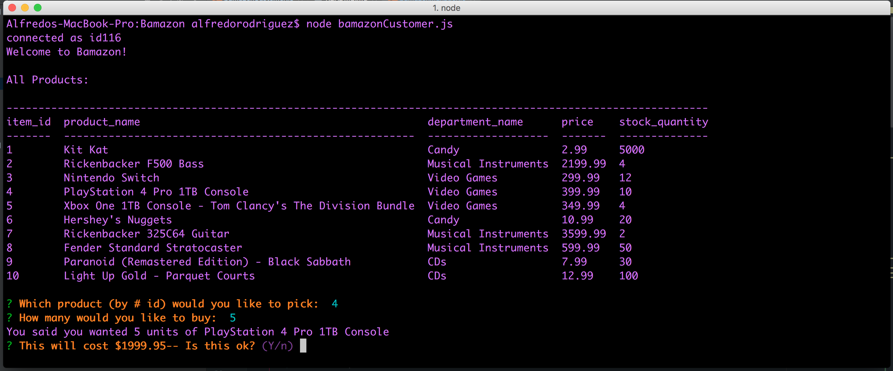
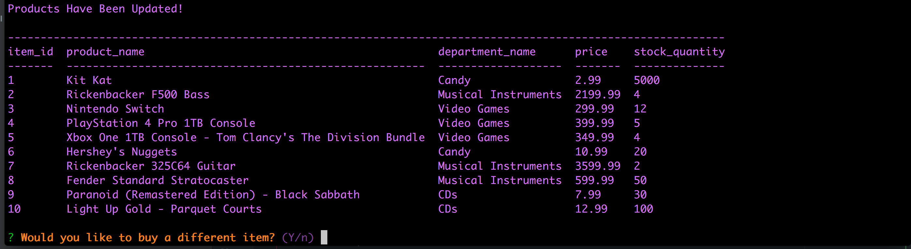
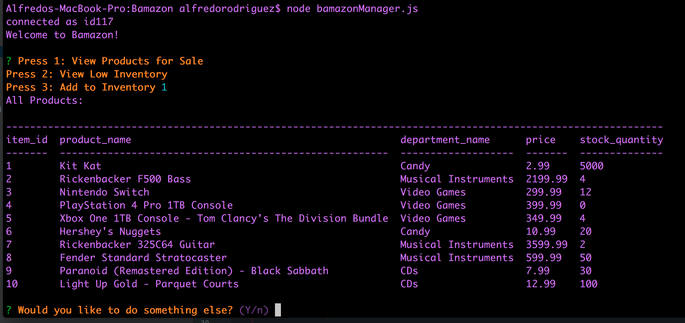

<h1 align="center">Bamazon</h1>

<h2>Info:</h2>

This web application allows you to use MySQL database and manage a small Amazon inventory list through the console

It also utilizes NPM modules such as: Console.table, Inquirer, MySQL

<h2>Bamazon Customer<h2>

    

This starts up the little terminal application and ask customer what they want to buy

    

After they have made their purchase Bamazon gives them an option to buy again or no

<h2>Bamazon Manager</h2>

    

Bamazon Manager allows to either check inventory, check low inventory, or to restock the inventory

    

The manager/staff is currently checking at what is low in the inventory

    

The Manager/staff is currently deciding what needs to be restocked

    

This option updates the inventory and restocks whatever is needed

<h3>Technologies used</h3>

<ul>
    <li><strong>HTML</strong></li>
    <li><strong>MySQL</strong></li>
    <li><strong>Javascript</strong></li>
    <li><strong>Node Modules Installed: Console.table, Inquirer, MySQL</strong></li>
</ul>

<h3>Check it out!</h3>

<ul>
    <li><strong>https://alrod909.github.io/Bamazon/</strong></li>
</ul>
